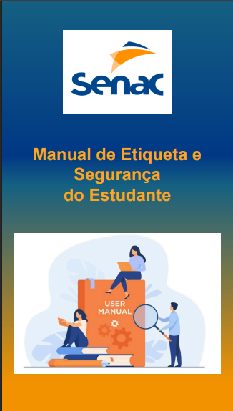
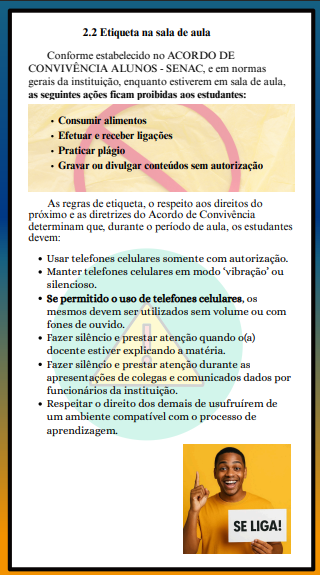
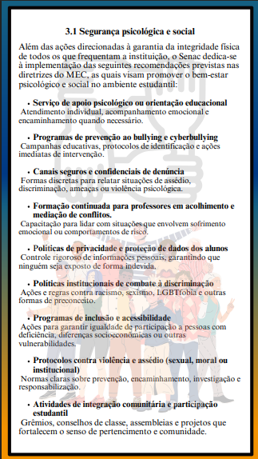
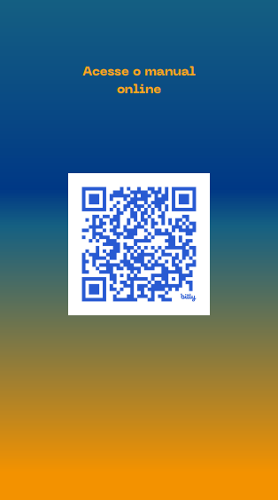
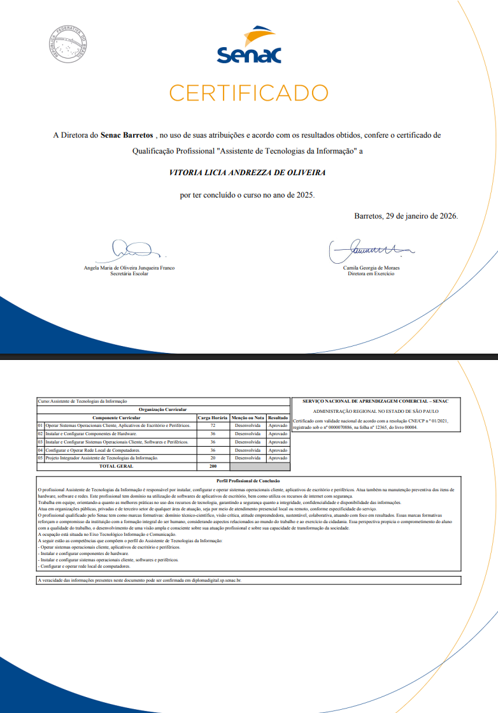

## Projeto integrador - Manual de Etiqueta e Segurança do Estudante (SENAC)

This repository presents a **Student Etiquette and Safety Manual**, developed as my **final integrative project (Projeto Integrador)** for the conclusion of the Information Technology Assistant course, successfully completed in 2025.

## 🎯 Purpose of this Repository

The main goal of this repository is to showcase the skills applied during the development of this project, including:

- 🎨 Graphic Design  
- 🔎 Content Research and Organization  
- 💻 Technical Skills (digital document creation and online publishing)  

## 📘 Manual Preview | Scan the QR code to view the manual online

     
   
 

## 🏫 Certification
**Information Technology Assistant**  
SENAC – Barretos (Brazil)

